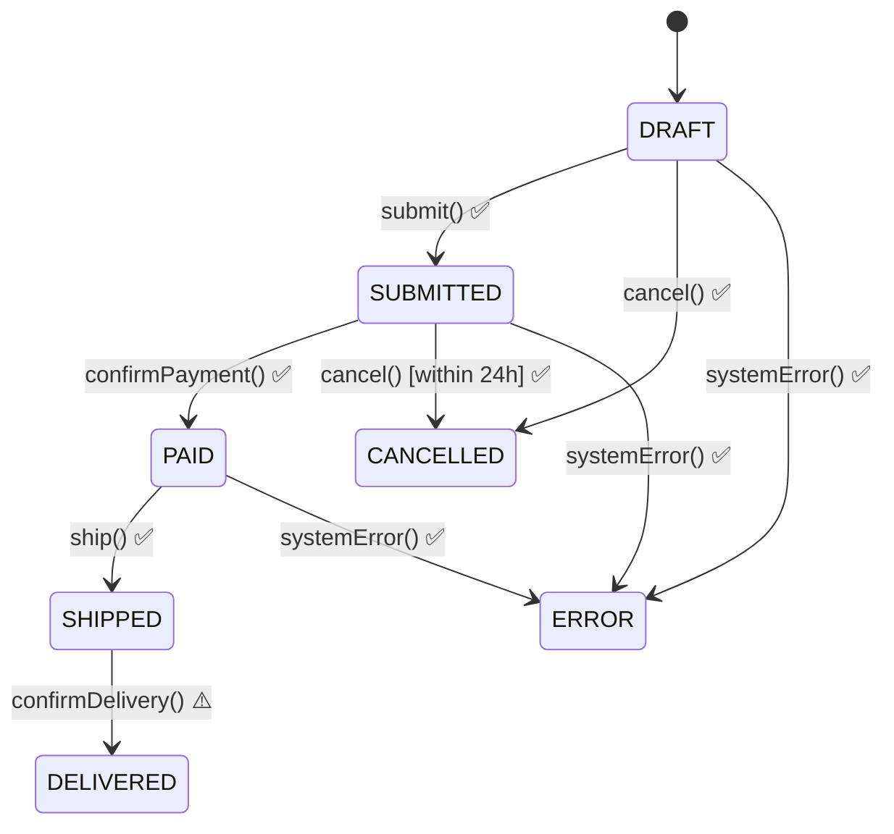

# DSL-First QA & Test Automation Guide

> **A guide for QA engineers and AI coding assistants: how to apply the DSL-First language family to test automation — extracting testable specifications, generating test suites, and producing living documentation.**

**Version**: 2.0  
**Date**: June 2026  
**Target Audience**: QA Engineers, Test Automation Engineers, AI Coding Assistants (Claude Code, Cursor, Windsurf, etc.)  
**Prerequisites**: Basic understanding of BDD, state machines, and the system under test. Familiarity with the [DSL-First Methodology Guide](DSL_FIRST_METHODOLOGY_GUIDE.md) and its three languages: [Kernel DSL](KERNEL_DSL.md), [Behavior DSL](BEHAVIOR_DSL.md), and [Verification DSL](VERIFICATION_DSL.md).

> **What's new in v2.0:** This guide no longer invents a separate "Test DSL" grammar. Instead it shows how to apply the three existing DSL-First languages to QA work: the **Kernel DSL** models state machines for transition coverage, the **Behavior DSL** models procedures for workflow testing, and the **Verification DSL** produces checkable claims and living documentation. Both bindings are covered: grammar-hosted (Java/ANTLR) and data-hosted (Clojure/EDN).

---

## Table of Contents

1. [Introduction](#1-introduction)
2. [The QA Workflow](#2-the-qa-dsl-workflow)
3. [Phase 1: Discovery & Extraction](#3-phase-1-discovery--extraction)
4. [Phase 2: Modeling with the DSL Family](#4-phase-2-modeling-with-the-dsl-family)
5. [Phase 3: BDD/Gherkin Integration](#5-phase-3-bddgherkin-integration)
6. [Phase 4: Test Generation](#6-phase-4-test-generation)
7. [Phase 5: Execution & Reporting](#7-phase-5-execution--reporting)
8. [AI Assistant Collaboration Patterns](#8-ai-assistant-collaboration-patterns)
9. [Dev/QA Separation of Duties](#9-devqa-separation-of-duties)
10. [Process Improvements & Open Questions](#10-process-improvements--open-questions)
11. [Tool Recommendations](#11-tool-recommendations)
12. [Templates & Examples](#12-templates--examples)

---

## 1. Introduction

### 1.1 What is DSL-First QA?

**DSL-First QA** applies the DSL-First language family to test automation. The methodology provides three languages; QA uses each for a different testing concern:

| DSL | QA Purpose | What you get |
|-----|-----------|--------------|
| **[Kernel DSL](KERNEL_DSL.md)** | Model entities as state machines | Transition coverage matrix, invalid-transition tests, state invariant checks |
| **[Behavior DSL](BEHAVIOR_DSL.md)** | Model procedures step by step | Workflow tests, failure-compensation tests, parallel-step verification |
| **[Verification DSL](VERIFICATION_DSL.md)** | Write checkable claims | Living documentation — prose where each claim shows its current PASS/FAIL verdict |

The workflow is the same as development: **extract** domain knowledge, **model** it in the DSLs, **derive** tests and documentation from the models. The difference is the starting point — QA often works from an *existing* codebase, extracting behavior rather than designing it.

```
Traditional QA:  Manual exploration → Ad-hoc test cases → Maintenance hell
DSL-First QA:    Extract behavior → Model in DSL family → Derive tests + living docs → Evolve model
```

### 1.2 Why DSL-First for QA?

| Challenge | Traditional Approach | DSL-First Approach |
|-----------|---------------------|-------------------|
| **Coverage gaps** | Manual identification | Generated from Kernel DSL state machine (all transitions) |
| **Test maintenance** | Update each test individually | Update DSL model, regenerate |
| **Dev/QA knowledge gap** | Verbal handoffs, stale docs | DSL is the shared executable specification |
| **Flaky tests** | Debug each failure | Model defines expected states and guards |
| **Living documentation** | Hand-written, drifts from code | Verification DSL renders prose with live PASS/FAIL verdicts |
| **Onboarding** | Read all tests | Read the DSL models to understand behavior |
| **Both bindings** | Rewrite tests per language | Same model, grammar-hosted (Java) or data-hosted (Clojure) derivation |

### 1.3 When to Use This Approach

**Good fit:**
- Complex state-based systems (workflows, transactions, agents)
- APIs with many endpoints and state combinations
- Existing codebase with implicit behavior (needs extraction)
- Team wants to increase coverage systematically
- AI assistant available to accelerate extraction

**Poor fit:**
- Simple CRUD with no complex states
- Exploratory testing (discovery phase only)
- One-off manual verification

---

## 2. The QA Workflow

```
┌─────────────────────────────────────────────────────────────────────────────┐
│  PHASE 1: DISCOVERY & EXTRACTION                                            │
│  ─────────────────────────────────                                          │
│  Input: Existing codebase, docs, API specs, user stories                    │
│  Activities:                                                                │
│    • AI-assisted code analysis (find states, transitions, validations)      │
│    • Interview developers / read PRs                                        │
│    • Experiment with running system                                         │
│    • Document edge cases and known bugs                                     │
│  Output: Raw behavior notes, state inventories, transition lists            │
└─────────────────────────────────────────────────────────────────────────────┘
                                    │
                                    ▼
┌─────────────────────────────────────────────────────────────────────────────┐
│  PHASE 2: MODELING WITH THE DSL FAMILY                                      │
│  ─────────────────────────────────                                          │
│  Input: Discovery artifacts                                                 │
│  Activities:                                                                │
│    • Model entities as state machines (Kernel DSL)                          │
│    • Model procedures step by step (Behavior DSL)                           │
│    • Write checkable claims (Verification DSL)                              │
│    • Add QA-specific annotations: test data, boundary values, coverage tags │
│  Output: *.dsl / *.edn model files, state diagrams, check files             │
└─────────────────────────────────────────────────────────────────────────────┘
                                    │
                                    ▼
┌─────────────────────────────────────────────────────────────────────────────┐
│  PHASE 3: BDD/GHERKIN INTEGRATION                                           │
│  ─────────────────────────────────                                          │
│  Input: DSL models                                                          │
│  Activities:                                                                │
│    • Generate .feature files from DSL                                       │
│    • Create scenario templates for each transition                          │
│    • Add business-language descriptions                                     │
│    • Review with stakeholders                                               │
│  Output: *.feature files, step definition stubs                             │
└─────────────────────────────────────────────────────────────────────────────┘
                                    │
                                    ▼
┌─────────────────────────────────────────────────────────────────────────────┐
│  PHASE 4: TEST GENERATION                                                   │
│  ────────────────────────                                                   │
│  Input: DSL + Gherkin templates                                             │
│  Activities:                                                                │
│    • Generate step definitions (glue code)                                  │
│    • Generate test data factories                                           │
│    • Generate negative test cases (invalid transitions)                     │
│    • Generate boundary value tests from constraints                         │
│  Output: Executable test suite                                              │
└─────────────────────────────────────────────────────────────────────────────┘
                                    │
                                    ▼
┌─────────────────────────────────────────────────────────────────────────────┐
│  PHASE 5: EXECUTION & REPORTING                                             │
│  ────────────────────────────────                                           │
│  Input: Test suite + running system                                         │
│  Activities:                                                                │
│    • Execute tests against environments                                     │
│    • Generate living documentation                                          │
│    • Track coverage by DSL concept (not just lines)                         │
│    • Report by state machine transition coverage                            │
│  Output: Test results, coverage reports, living docs                        │
└─────────────────────────────────────────────────────────────────────────────┘
```

---

## 3. Phase 1: Discovery & Extraction

### 3.1 AI-Assisted Code Analysis

Use an AI coding assistant (Claude Code, Cursor, Windsurf) to extract behavior:

#### Prompt Template: State Discovery

```markdown
Analyze the following code and extract:
1. All possible states (enums, status fields, boolean flags that represent state)
2. State transitions (methods that change state)
3. Guards/preconditions for each transition
4. Side effects (events emitted, external calls)
5. Invariants (conditions that must always be true)

Focus on: [Entity name, e.g., "Order", "Agent", "Task"]

Code context:
[Paste relevant code or use @file references]
```

#### Prompt Template: API Endpoint Analysis

```markdown
Analyze this API controller/service and extract:
1. All endpoints with HTTP methods
2. Request/response schemas
3. Validation rules (required fields, formats, ranges)
4. Error responses and conditions
5. Authentication/authorization requirements
6. Rate limiting or quotas

Output as a structured table or DSL snippet.
```

#### Prompt Template: Business Rule Extraction

```markdown
From the following code, documentation, and tests, extract business rules:
1. Conditional logic that enforces business policies
2. Calculations or formulas
3. Temporal constraints (timeouts, deadlines, sequences)
4. Data constraints (uniqueness, referential integrity)
5. Role-based access rules

Format each rule as:
- Rule ID: BR-001
- Description: [human readable]
- Condition: [predicate]
- Action: [what happens if condition met/not met]
- Source: [file:line or doc section]
```

### 3.2 Discovery Checklist

```markdown
## Discovery Checklist for [Entity/Feature]

### Code Analysis
- [ ] Identified all state enums/fields
- [ ] Mapped all state-changing methods
- [ ] Documented method signatures and return types
- [ ] Found all validation logic
- [ ] Identified external dependencies (APIs, DBs, queues)

### Documentation Review
- [ ] Read API docs / OpenAPI spec
- [ ] Reviewed user stories / acceptance criteria
- [ ] Checked architecture decision records (ADRs)
- [ ] Found sequence diagrams or flow charts

### Experimentation
- [ ] Ran happy path scenarios manually
- [ ] Tested error conditions
- [ ] Checked boundary values
- [ ] Verified concurrent access behavior
- [ ] Tested with missing/malformed data

### Developer Interview Questions
- [ ] "What are the most common bugs in this area?"
- [ ] "What states should never be reached?"
- [ ] "What external systems affect this behavior?"
- [ ] "What happens during failures/retries?"
- [ ] "Are there any race conditions to watch for?"
```

### 3.3 Output: Behavior Notes

```markdown
# Behavior Notes: Order Processing

## States Identified
| State | Description | Entry Conditions |
|-------|-------------|------------------|
| DRAFT | Initial state | Order created |
| SUBMITTED | Awaiting payment | submit() called with items |
| PAID | Payment confirmed | Payment gateway callback |
| SHIPPED | In transit | Shipping label generated |
| DELIVERED | Complete | Carrier delivery confirmation |
| CANCELLED | Terminated | User/admin cancellation |

## Transitions Observed
| From | To | Trigger | Guards | Events |
|------|----|---------| -------|--------|
| DRAFT | SUBMITTED | submit() | items.notEmpty, address.valid | OrderSubmitted |
| DRAFT | CANCELLED | cancel() | - | OrderCancelled |
| SUBMITTED | PAID | paymentConfirmed() | payment.amount == order.total | PaymentReceived |
| SUBMITTED | CANCELLED | cancel() | within 24h | OrderCancelled |
| * | ERROR | onError() | exception thrown | OrderFailed |

## Business Rules
- BR-001: Orders over $500 require manager approval before shipping
- BR-002: Cancellation only allowed within 24h of submission
- BR-003: Partial payments not accepted

## Edge Cases / Known Issues
- Race condition if two payments arrive simultaneously
- Timeout handling unclear for payment gateway
```

---

## 4. Phase 2: Modeling with the DSL Family

### 4.1 Use the Kernel DSL for State Machine Modeling

The Kernel DSL already models entities as state machines with states, transitions, guards, and events. QA does not need a separate grammar — the same model the developers write (or the AI extracts from existing code) drives test generation.

#### Grammar-hosted (Java/ANTLR) — Kernel DSL

```dsl
domain order-processing {

    level catalog {

        model Order {
            description "Customer order lifecycle."
            fields {
                id:          OrderId
                customerId:  CustomerId
                items:       List<OrderItem>
                total:       Decimal
                status:      OrderStatus
                createdAt:   Timestamp
                shippedAt:   Timestamp optional
            }

            states { DRAFT, SUBMITTED, PAID, SHIPPED, DELIVERED, CANCELLED, ERROR }

            transitions {
                DRAFT     -> SUBMITTED  on submit          // items.notEmpty, address.valid
                DRAFT     -> CANCELLED  on cancel
                SUBMITTED -> PAID       on confirmPayment   // payment.amount == total
                SUBMITTED -> CANCELLED  on cancel           // within 24h
                PAID      -> SHIPPED    on ship             // inventory.reserved
                SHIPPED   -> DELIVERED  on confirmDelivery
                *         -> ERROR      on systemError
            }

            invariants {
                "total must equal sum of item prices"
                "shippedAt must be after createdAt"
                "status must be in defined states"
            }
        }
    }
}
```

#### Data-hosted (Clojure/EDN) — same model, as data

```clojure
{:domain :order-processing
 :levels
 {:catalog
  {:models
   {:Order
    {:description "Customer order lifecycle."
     :fields {:id :order-id
              :customer-id :customer-id
              :items [:vector :map]
              :total :decimal
              :status :order-status
              :created-at :timestamp
              :shipped-at {:optional true} :timestamp}
     :states #{:draft :submitted :paid :shipped :delivered :cancelled :error}
     :transitions
     [[:draft     :submitted  :submit          [:items-not-empty :address-valid]]
      [:draft     :cancelled  :cancel          []]
      [:submitted :paid       :confirm-payment [:payment-matches-total]]
      [:submitted :cancelled  :cancel          [:within-24h]]
      [:paid      :shipped    :ship            [:inventory-reserved]]
      [:shipped   :delivered  :confirm-delivery []]
      [:*         :error      :system-error    []]]
     :invariants
     ["total must equal sum of item prices"
      "shippedAt must be after createdAt"
      "status must be in defined states"]}}}}}
```

Both are the same model. The grammar-hosted version is parsed from text; the data-hosted version is read directly. Either way, the test generator walks the same semantic model.

### 4.2 Use the Verification DSL for Checkable Claims

The Verification DSL produces checkable claims and living documentation — exactly what QA needs for stakeholder-readable test reports. Each claim calls a host operation and asserts on the result:

```
verification OrderLifecycle {
    description "What a placed order can and cannot do."

    check OrderCanBeSubmitted {
        given order = createOrder(items: [SKU-001])
        when result = submitOrder(order.id)
        expect result.status == "SUBMITTED"
    }

    check EmptyOrderCannotBeSubmitted {
        given order = createOrder(items: [])
        when result = submitOrder(order.id)
        expect result.status == "ERROR"
    }

    check PaidOrderCannotBeResubmitted {
        given order = createPaidOrder()
        when result = submitOrder(order.id)
        expect result.status == "ERROR"
        expect result.error == "ALREADY_SUBMITTED"
    }

    check CancelledOrderRejectsAllTransitions {
        given order = createCancelledOrder()
        when result = shipOrder(order.id)
        expect result.status == "ERROR"
    }
}
```

Running the model produces living documentation — prose where each claim shows its current PASS/FAIL verdict. See the [Verification DSL specification](VERIFICATION_DSL.md) for the full language.

### 4.3 QA-Specific Extensions: Test Data and Coverage Annotations

The DSL family models behavior. QA adds **test-data annotations** — not a new grammar, but conventions layered on the model for test generation:

#### Grammar-hosted — test data annotations in the model file

```dsl
// In the Kernel DSL model, QA adds @test annotations:
model Order {
    fields {
        items:  List<OrderItem>   @boundary(min=1, max=100)
        total:  Decimal           @boundary(min=0.01, max=999999.99)
        customerId: CustomerId    @invalid("", null, "invalid-format")
    }
}
```

#### Data-hosted — test data as a separate EDN map

```clojure
{:test-data
 {:Order
  {:valid   {:customer-id "cust-123"
             :items [{:sku "SKU001" :qty 1 :price 29.99}]}
   :invalid {:customer-id ["" nil "invalid-format"]
             :items       [[] nil]
             :total       [-1 0 nil]}
   :boundary {:items    [1 100 101]    ;; min, max, over-max
              :total    [0.01 999999.99 1000000.00]}}}}
```

These annotations drive the test data factory generator (§6.3) and the coverage matrix (§6.2). They live alongside the model, not inside a separate Test DSL.

### 4.4 Business Rules as Verification DSL Checks

Business rules that the Kernel DSL cannot express (temporal constraints, cross-entity policies) become Verification DSL checks:

```
verification OrderBusinessRules {
    description "Business policies for order processing."

    check HighValueOrdersRequireApproval {
        given order = createOrder(total: 600.00)
        when result = shipOrder(order.id)
        expect result.status == "ERROR"
        expect result.error == "MANAGER_APPROVAL_REQUIRED"
    }

    check CancellationWindowExpiresAfter24Hours {
        given order = createSubmittedOrder(submittedAt: now - 25h)
        when result = cancelOrder(order.id)
        expect result.status == "ERROR"
        expect result.error == "CANCELLATION_WINDOW_EXPIRED"
    }
}
```

### 4.5 State Machine Diagram Generation

Generate from DSL:

```
┌─────────┐    submit()     ┌───────────┐   confirmPayment()   ┌──────┐
│  DRAFT  │────────────────▶│ SUBMITTED │────────────────────▶│ PAID │
└────┬────┘                 └─────┬─────┘                      └──┬───┘
     │                            │                               │
     │ cancel()                   │ cancel()                      │ ship()
     │                            │ [within 24h]                  │
     ▼                            ▼                               ▼
┌───────────┐              ┌───────────┐                    ┌─────────┐
│ CANCELLED │              │ CANCELLED │                    │ SHIPPED │
└───────────┘              └───────────┘                    └────┬────┘
                                                                 │
     ┌───────────────────────────────────────────────────────────┘
     │ confirmDelivery()
     ▼
┌───────────┐
│ DELIVERED │
└───────────┘

[Any state] --systemError()--> ERROR
```

---

## 5. Phase 3: BDD/Gherkin Integration

### 5.1 Generating Feature Files from the Kernel DSL

Transform Kernel DSL transitions into Gherkin scenarios:

**Generator Template:**

```gherkin
# Generated from: order-processing.dsl (Kernel DSL)
# Entity: Order
# Transition: {fromState} -> {toState} on {trigger}

Feature: Order {trigger} transition
  As a customer
  I want to {trigger} my order
  So that {business value}

  Background:
    Given an order exists in "{fromState}" state

  @generated @{fromState}-to-{toState}
  Scenario: Successfully {trigger} order
    {for each 'given' in transition}
    Given {given.predicate}
    {end for}
    When {transition.when}
    {for each 'then' in transition}
    Then {then.assertion}
    {end for}

  @generated @negative @{fromState}-to-{toState}
  Scenario Outline: Fail to {trigger} order when preconditions not met
    Given <precondition_violation>
    When I attempt to {trigger} the order
    Then the transition should be rejected
    And the order should remain in "{fromState}" state
    And an error message should indicate "<error_reason>"

    Examples:
      | precondition_violation | error_reason |
      {for each 'given' in transition}
      | {negate(given.predicate)} | {given.predicate} not satisfied |
      {end for}
```

### 5.2 Generated Feature File Example

```gherkin
# Generated from: order-processing.dsl (Kernel DSL)
# Transition: DRAFT -> SUBMITTED on submit
# Generated: 2026-01-29T09:00:00Z

Feature: Order submission
  As a customer
  I want to submit my draft order
  So that it can be processed for payment and shipping

  Background:
    Given an order exists in "DRAFT" state
    And the order has the following items:
      | sku     | quantity | price |
      | SKU001  | 2        | 29.99 |
      | SKU002  | 1        | 49.99 |

  @generated @happy-path @DRAFT-to-SUBMITTED
  Scenario: Successfully submit order with valid data
    Given the items list is not empty
    And the shipping address is valid
    When the customer clicks submit
    Then the order status should be "SUBMITTED"
    And an "OrderSubmitted" event should be emitted
    And the order should have a submission timestamp

  @generated @negative @DRAFT-to-SUBMITTED @empty-items
  Scenario: Fail to submit order with no items
    Given the items list is empty
    When I attempt to submit the order
    Then the transition should be rejected
    And the order should remain in "DRAFT" state
    And an error message should indicate "Order must have at least one item"

  @generated @negative @DRAFT-to-SUBMITTED @invalid-address
  Scenario: Fail to submit order with invalid shipping address
    Given the shipping address is invalid
    When I attempt to submit the order
    Then the transition should be rejected
    And the order should remain in "DRAFT" state
    And an error message should indicate "Valid shipping address required"

  @generated @boundary @DRAFT-to-SUBMITTED
  Scenario Outline: Submit order with boundary item counts
    Given the order has <item_count> items
    When I attempt to submit the order
    Then the result should be "<expected_result>"

    Examples:
      | item_count | expected_result |
      | 1          | success         |
      | 100        | success         |
      | 101        | rejected        |
      | 0          | rejected        |

# Transition: SUBMITTED -> CANCELLED on cancel
# Business Rule: CancellationWindow

  @generated @happy-path @SUBMITTED-to-CANCELLED
  Scenario: Successfully cancel order within 24 hours
    Given an order exists in "SUBMITTED" state
    And the order was submitted less than 24 hours ago
    When the customer requests cancellation
    Then the order status should be "CANCELLED"
    And an "OrderCancelled" event should be emitted

  @generated @negative @SUBMITTED-to-CANCELLED @time-window
  Scenario: Fail to cancel order after 24 hours
    Given an order exists in "SUBMITTED" state
    And the order was submitted more than 24 hours ago
    When the customer requests cancellation
    Then the cancellation should be rejected
    And the order should remain in "SUBMITTED" state
    And an error message should indicate "Cancellation window expired"
```

### 5.3 Step Definition Generation

Generate glue code stubs:

```java
// Generated from: order-processing.dsl (Kernel DSL)
// Step definitions for Order entity transitions

package com.example.steps;

import io.cucumber.java.en.*;
import static org.assertj.core.api.Assertions.*;

public class OrderSteps {

    private Order order;
    private Exception lastException;
    private List<DomainEvent> capturedEvents;

    // === Background Steps ===

    @Given("an order exists in {string} state")
    public void anOrderExistsInState(String stateName) {
        OrderState state = OrderState.valueOf(stateName);
        order = OrderTestFactory.createInState(state);
        capturedEvents = new ArrayList<>();
        order.registerEventListener(capturedEvents::add);
    }

    @Given("the order has the following items:")
    public void theOrderHasItems(DataTable dataTable) {
        List<OrderItem> items = dataTable.asMaps().stream()
            .map(row -> new OrderItem(
                row.get("sku"),
                Integer.parseInt(row.get("quantity")),
                new BigDecimal(row.get("price"))
            ))
            .toList();
        order.setItems(items);
    }

    // === Precondition Steps (Given) ===

    @Given("the items list is not empty")
    public void theItemsListIsNotEmpty() {
        assertThat(order.getItems()).isNotEmpty();
    }

    @Given("the items list is empty")
    public void theItemsListIsEmpty() {
        order.setItems(Collections.emptyList());
    }

    @Given("the shipping address is valid")
    public void theShippingAddressIsValid() {
        order.setShippingAddress(AddressTestFactory.validUSAddress());
    }

    @Given("the shipping address is invalid")
    public void theShippingAddressIsInvalid() {
        order.setShippingAddress(AddressTestFactory.invalidAddress());
    }

    @Given("the order was submitted less than 24 hours ago")
    public void orderSubmittedWithin24Hours() {
        order.setSubmittedAt(Instant.now().minus(Duration.ofHours(12)));
    }

    @Given("the order was submitted more than 24 hours ago")
    public void orderSubmittedOver24HoursAgo() {
        order.setSubmittedAt(Instant.now().minus(Duration.ofHours(25)));
    }

    @Given("the order has {int} items")
    public void theOrderHasNItems(int count) {
        order.setItems(OrderTestFactory.generateItems(count));
    }

    // === Action Steps (When) ===

    @When("the customer clicks submit")
    @When("I attempt to submit the order")
    public void attemptToSubmitOrder() {
        try {
            order.submit();
            lastException = null;
        } catch (Exception e) {
            lastException = e;
        }
    }

    @When("the customer requests cancellation")
    @When("I attempt to cancel the order")
    public void attemptToCancelOrder() {
        try {
            order.cancel();
            lastException = null;
        } catch (Exception e) {
            lastException = e;
        }
    }

    // === Assertion Steps (Then) ===

    @Then("the order status should be {string}")
    public void orderStatusShouldBe(String expectedStatus) {
        assertThat(order.getState().name()).isEqualTo(expectedStatus);
    }

    @Then("the order should remain in {string} state")
    public void orderShouldRemainInState(String expectedStatus) {
        assertThat(order.getState().name()).isEqualTo(expectedStatus);
    }

    @Then("an {string} event should be emitted")
    public void eventShouldBeEmitted(String eventType) {
        assertThat(capturedEvents)
            .anyMatch(e -> e.getClass().getSimpleName().equals(eventType));
    }

    @Then("the transition should be rejected")
    @Then("the cancellation should be rejected")
    public void transitionShouldBeRejected() {
        assertThat(lastException).isNotNull();
    }

    @Then("an error message should indicate {string}")
    public void errorMessageShouldIndicate(String expectedMessage) {
        assertThat(lastException.getMessage()).contains(expectedMessage);
    }

    @Then("the result should be {string}")
    public void theResultShouldBe(String result) {
        if ("success".equals(result)) {
            assertThat(lastException).isNull();
        } else {
            assertThat(lastException).isNotNull();
        }
    }

    @Then("the order should have a submission timestamp")
    public void orderShouldHaveSubmissionTimestamp() {
        assertThat(order.getSubmittedAt()).isNotNull();
    }
}
```

---

## 6. Phase 4: Test Generation

### 6.1 Test Categories Generated from DSL

| Category | Source in DSL | Generated Tests |
|----------|--------------|-----------------|
| **Happy Path** | Each valid transition in Kernel DSL | 1 per transition |
| **Negative (Guards)** | Each guard on a Kernel DSL transition | 1 per precondition violation |
| **Negative (Invalid State)** | Kernel DSL state machine (missing transitions) | From states where transition not defined |
| **Boundary** | `@boundary` annotations on fields | Min, max, over-max for each field |
| **Invalid Data** | `@invalid` annotations on fields | Each invalid value combination |
| **Timeout** | Behavior DSL `within` clauses | Timeout exceeded scenarios |
| **Invariant** | Kernel DSL `invariants` | Verify invariant after each operation |
| **Business Rule** | Verification DSL checks | Rule trigger/not-trigger scenarios |
| **Living Documentation** | Verification DSL prose layer | PASS/FAIL verdicts rendered in docs |

### 6.2 Test Matrix Generator

From DSL, generate a coverage matrix:

```markdown
## Test Coverage Matrix: Order Entity

### State Transition Coverage

| From State | To State | Trigger | Happy Path | Guard Tests | Timeout | Coverage |
|------------|----------|---------|------------|-------------|---------|----------|
| DRAFT | SUBMITTED | submit | ✅ TC-001 | ✅ TC-002, TC-003 | - | 100% |
| DRAFT | CANCELLED | cancel | ✅ TC-010 | - | - | 100% |
| SUBMITTED | PAID | confirmPayment | ✅ TC-020 | ✅ TC-021 | ✅ TC-022 | 100% |
| SUBMITTED | CANCELLED | cancel | ✅ TC-030 | ✅ TC-031 | - | 100% |
| PAID | SHIPPED | ship | ✅ TC-040 | ✅ TC-041, TC-042 | - | 100% |
| SHIPPED | DELIVERED | confirmDelivery | ✅ TC-050 | - | - | 100% |
| * | ERROR | systemError | ✅ TC-060 | - | - | 100% |

### Invalid Transition Coverage (Negative Tests)

| From State | Attempted Trigger | Expected Result | Test ID |
|------------|-------------------|-----------------|---------|
| DRAFT | confirmPayment | IllegalStateException | TC-100 |
| DRAFT | ship | IllegalStateException | TC-101 |
| SUBMITTED | submit | IllegalStateException | TC-102 |
| SUBMITTED | ship | IllegalStateException | TC-103 |
| PAID | submit | IllegalStateException | TC-104 |
| CANCELLED | * (any) | IllegalStateException | TC-110 |
| DELIVERED | * (any) | IllegalStateException | TC-111 |

### Business Rule Coverage

| Rule ID | Rule Name | Positive Test | Negative Test | Coverage |
|---------|-----------|---------------|---------------|----------|
| BR-001 | HighValueOrderApproval | TC-200 | TC-201 | 100% |
| BR-002 | CancellationWindow | TC-030 | TC-031 | 100% |

### Data Validation Coverage

| Field | Valid Values | Invalid Values | Boundary | Coverage |
|-------|--------------|----------------|----------|----------|
| items | TC-001 | TC-002, TC-003 | TC-004, TC-005 | 100% |
| total | TC-020 | TC-022, TC-023 | TC-024, TC-025 | 100% |
| customerId | TC-001 | TC-006, TC-007 | - | 100% |
```

### 6.3 Test Data Factory Generation

```java
// Generated from: order-processing.dsl (Kernel DSL)
// Test data factories for Order entity

public class OrderTestFactory {

    // === Valid Data ===
    
    public static Order validDraftOrder() {
        return Order.builder()
            .id(UUID.randomUUID().toString())
            .customerId("cust-" + RandomStringUtils.randomAlphanumeric(8))
            .items(List.of(validOrderItem()))
            .shippingAddress(AddressTestFactory.validUSAddress())
            .build();
    }
    
    public static OrderItem validOrderItem() {
        return new OrderItem("SKU-001", 1, new BigDecimal("29.99"));
    }
    
    public static List<OrderItem> generateItems(int count) {
        return IntStream.range(0, count)
            .mapToObj(i -> new OrderItem("SKU-" + i, 1, new BigDecimal("9.99")))
            .toList();
    }
    
    // === Invalid Data (from DSL 'invalid' annotations) ===
    
    public static Stream<Arguments> invalidCustomerIds() {
        return Stream.of(
            Arguments.of("", "Empty customer ID"),
            Arguments.of(null, "Null customer ID"),
            Arguments.of("invalid-format", "Invalid format")
        );
    }
    
    public static Stream<Arguments> invalidItemLists() {
        return Stream.of(
            Arguments.of(Collections.emptyList(), "Empty items list"),
            Arguments.of(null, "Null items list")
        );
    }
    
    public static Stream<Arguments> invalidTotals() {
        return Stream.of(
            Arguments.of(new BigDecimal("-1"), "Negative total"),
            Arguments.of(BigDecimal.ZERO, "Zero total"),
            Arguments.of(null, "Null total")
        );
    }
    
    // === Boundary Data (from DSL 'boundary' annotations) ===
    
    public static Stream<Arguments> boundaryItemCounts() {
        return Stream.of(
            Arguments.of(1, true, "Minimum items"),
            Arguments.of(100, true, "Maximum items"),
            Arguments.of(101, false, "Over maximum items"),
            Arguments.of(0, false, "Below minimum items")
        );
    }
    
    public static Stream<Arguments> boundaryTotals() {
        return Stream.of(
            Arguments.of(new BigDecimal("0.01"), true, "Minimum total"),
            Arguments.of(new BigDecimal("999999.99"), true, "Maximum total"),
            Arguments.of(new BigDecimal("1000000.00"), false, "Over maximum total")
        );
    }
    
    // === State Factories ===
    
    public static Order createInState(OrderState state) {
        Order order = validDraftOrder();
        switch (state) {
            case DRAFT -> { /* already in draft */ }
            case SUBMITTED -> order.submit();
            case PAID -> { order.submit(); order.confirmPayment(validPayment()); }
            case SHIPPED -> { 
                order.submit(); 
                order.confirmPayment(validPayment()); 
                order.ship(validShipment()); 
            }
            case DELIVERED -> {
                order.submit();
                order.confirmPayment(validPayment());
                order.ship(validShipment());
                order.confirmDelivery(validDelivery());
            }
            case CANCELLED -> { order.cancel(); }
            case ERROR -> { order.triggerError(new RuntimeException("Test error")); }
        }
        return order;
    }
}
```

---

## 7. Phase 5: Execution & Reporting

### 7.1 Living Documentation Generation

The Verification DSL produces living documentation natively — prose where each claim shows its current PASS/FAIL verdict. When used alongside the generated test suite, the coverage report combines both:

```markdown
# Order Processing - Living Documentation

*Generated: 2026-01-29 | Last Test Run: 2026-01-29 09:30 UTC | Pass Rate: 98%*

## State Machine



## Transition Test Results

| Transition | Tests | Passed | Failed | Skipped |
|------------|-------|--------|--------|---------|
| DRAFT → SUBMITTED | 5 | 5 | 0 | 0 |
| DRAFT → CANCELLED | 2 | 2 | 0 | 0 |
| SUBMITTED → PAID | 4 | 4 | 0 | 0 |
| SUBMITTED → CANCELLED | 3 | 3 | 0 | 0 |
| PAID → SHIPPED | 4 | 4 | 0 | 0 |
| SHIPPED → DELIVERED | 2 | 1 | 1 | 0 |

## Failed Scenarios

### ⚠️ TC-050: Confirm delivery with tracking update
**Feature**: Order delivery confirmation  
**Scenario**: Successfully confirm delivery  
**Status**: FAILED  
**Error**: `AssertionError: Expected tracking status DELIVERED but was IN_TRANSIT`  
**Root Cause**: Carrier API returned stale data (caching issue)  
**DSL Reference**: `SHIPPED -> DELIVERED on confirmDelivery`

## Business Rule Coverage

| Rule | Description | Status |
|------|-------------|--------|
| BR-001 | High value orders require approval | ✅ Verified |
| BR-002 | 24-hour cancellation window | ✅ Verified |
```

### 7.2 Coverage by DSL Concept

Traditional coverage measures lines/branches. DSL-First QA measures coverage by Kernel DSL and Verification DSL concepts:

```markdown
## DSL Concept Coverage Report

### State Coverage: 100% (7/7)
All defined states have been reached in tests.

### Transition Coverage: 100% (8/8)
All defined transitions have been exercised.

### Guard Coverage: 87% (13/15)
| Guard | Tested True | Tested False |
|-------|-------------|--------------|
| items.notEmpty | ✅ | ✅ |
| address.valid | ✅ | ✅ |
| payment.amount == total | ✅ | ✅ |
| within24Hours | ✅ | ✅ |
| inventory.reserved | ✅ | ❌ (TODO) |
| shippingLabel.generated | ✅ | ❌ (TODO) |

### Event Coverage: 100% (8/8)
All defined events have been verified emitted.

### Business Rule Coverage: 100% (2/2)
All rules have positive and negative test cases.

### Invariant Coverage: 66% (2/3)
| Invariant | Verified |
|-----------|----------|
| total == sum(items.price) | ✅ |
| shippedAt > createdAt | ✅ |
| status in defined states | ❌ (Implicit) |
```

---

## 8. AI Assistant Collaboration Patterns

### 8.1 Claude Code Workflow for QA

```markdown
## Session: Test DSL Creation for [Feature]

### Phase 1: Discovery (AI-Assisted)

**Human**: I need to create test coverage for the Order module. 
Start by analyzing these files: @OrderController.java @OrderService.java @Order.java

**Claude**: I'll analyze these files to extract testable behavior...
[Provides structured behavior notes]

**Human**: What states did you find? Generate a state diagram.

**Claude**: Found 7 states: DRAFT, SUBMITTED, PAID, SHIPPED, DELIVERED, CANCELLED, ERROR
[Generates ASCII/Mermaid diagram]

### Phase 2: DSL Creation (Collaborative)

**Human**: Create a test DSL file for Order based on your analysis.

**Claude**: [Generates order-processing.test.dsl]

**Human**: Add boundary tests for the `items` field - min 1, max 100.

**Claude**: [Updates DSL with boundary annotations]

### Phase 3: Gherkin Generation

**Human**: Generate feature files from the DSL.

**Claude**: [Generates .feature files with scenarios]

**Human**: The business team wants more readable scenario names. Rewrite.

**Claude**: [Improves scenario names with business language]

### Phase 4: Step Definition Generation

**Human**: Generate step definitions in Java with AssertJ.

**Claude**: [Generates step definition classes]

### Phase 5: Review & Iterate

**Human**: Run the tests. Here's the output: [paste failures]

**Claude**: I see 3 failures. Let me analyze:
1. TC-031 failed because...
[Provides analysis and fixes]
```

### 8.2 Prompt Templates for Claude Code

#### Discovery Prompt

```markdown
@Order.java @OrderService.java @OrderController.java

Analyze these files and extract:
1. All states the Order entity can be in
2. All transitions (state changes) with their triggers
3. Guards/preconditions for each transition
4. Events emitted during transitions
5. Business rules and validation logic

Output as a structured behavior notes document following the format in
@dsl_first_methodology/DSL_FIRST_QA_GUIDE.md Section 3.3
```

#### Kernel DSL Generation Prompt

```markdown
Based on the behavior notes for Order, create a Kernel DSL model file following the
grammar in @dsl_first_methodology/KERNEL_DSL.md

Include:
- All states and transitions
- Guards for each transition
- Invariants for the entity
- Events emitted on each transition
```

#### Verification DSL Generation Prompt

```markdown
Based on the behavior notes for Order, create a Verification DSL file following the
specification in @dsl_first_methodology/VERIFICATION_DSL.md

Include:
- Happy-path checks for each transition
- Negative checks for guard violations
- Invalid-transition checks (wrong state for trigger)
- Business rule checks
```

#### Gherkin Generation Prompt

```markdown
Generate Cucumber feature files from the Kernel DSL model @order-processing.dsl

Requirements:
- One feature file per major transition group
- Include @generated tags for traceability
- Add @happy-path, @negative, @boundary tags
- Use business-friendly language in scenario names
- Include Background for common setup
- Generate Scenario Outlines for data-driven tests
```

#### Step Definition Prompt

```markdown
Generate Java step definitions for @order-submission.feature

Requirements:
- Use Cucumber Java 8 style
- Use AssertJ for assertions
- Create a shared test context class
- Generate test data factories
- Add TODO comments where manual implementation needed
```

### 8.3 Iterative Refinement Pattern

```markdown
## Refinement Loop

1. **Generate** initial DSL/tests with AI
2. **Review** with human QA/Dev
3. **Execute** tests against system
4. **Analyze** failures with AI assistance
5. **Refine** DSL based on actual behavior
6. **Regenerate** and repeat

Each iteration improves:
- DSL accuracy (matches actual system)
- Test coverage (catches more bugs)
- Documentation (living docs update)
```

---

## 9. Dev/QA Separation of Duties

### 9.1 Responsibility Matrix

| Artifact | Dev Responsibility | QA Responsibility | AI Assistance |
|----------|-------------------|-------------------|---------------|
| Production Code | ✅ Write & maintain | Review | Analyze for extraction |
| Kernel DSL Model | ✅ Define & maintain (new features) | ✅ Extract from existing code & validate | Generate initial draft |
| Behavior DSL Model | ✅ Define & maintain (new features) | ✅ Extract from existing code & generate workflow tests | Generate initial draft |
| Verification DSL Checks | Review | ✅ Define & maintain | Generate from model |
| Feature Files | Review | ✅ Write & maintain | Generate from Kernel DSL + Behavior DSL |
| Step Definitions | Support | ✅ Implement | Generate stubs |
| Test Data | Provide examples | ✅ Expand coverage | Generate variations |
| Living Docs | Review | ✅ Generate & publish | Format & structure |

### 9.2 Handoff Points

```
┌─────────┐                              ┌─────────┐
│   DEV   │                              │   QA    │
└────┬────┘                              └────┬────┘
     │                                        │
     │ 1. Code complete + Kernel DSL model          │
     │───────────────────────────────────────▶│
     │                                        │
     │ 2. Questions about behavior            │
     │◀───────────────────────────────────────│
     │                                        │
     │ 3. Clarifications / model updates      │
     │───────────────────────────────────────▶│
     │                                        │
     │                                        │ 4. Verification DSL + Feature files
     │                                        │    (AI-assisted generation)
     │                                        │
     │ 5. Bug reports with DSL references     │
     │◀───────────────────────────────────────│
     │                                        │
     │ 6. Fixes + Kernel DSL updates          │
     │───────────────────────────────────────▶│
     │                                        │
     │                                        │ 7. Regenerate tests + verify
```

### 9.3 Shared Artifacts

```
project/
├── src/main/                    # Dev owns
├── src/test/                    # Dev unit tests
├── dsl/
│   ├── catalog/                 # Dev owns — Kernel DSL models
│   │   └── order.dsl
│   ├── behavior/                # Dev owns — Behavior DSL models
│   │   └── order-processing.behavior
│   └── verification/            # QA owns — Verification DSL checks
│       └── order-lifecycle.verify
├── features/                    # QA owns — Gherkin (generated from Kernel DSL)
│   ├── order-submission.feature
│   └── order-cancellation.feature
├── step-definitions/            # QA owns
├── test-reports/                # Generated
└── living-docs/                 # Generated from Verification DSL
```

### 9.4 Sync Workflow

```markdown
## Weekly DSL Sync

1. **Dev updates Kernel DSL** with new features/changes
2. **QA reviews** Kernel DSL diff
3. **AI generates** delta report: "New transitions to test"
4. **QA updates** Verification DSL with new coverage
5. **AI generates** new feature files and step stubs
6. **QA implements** step definitions
7. **Both review** living documentation
```

---

## 10. Process Improvements & Open Questions

### 10.1 Proposed Improvements

#### Improvement 1: Bidirectional DSL Sync

**Current**: Kernel DSL → Verification DSL → Tests (one-way)

**Proposed**: 
- Test failures update Verification DSL annotations
- Verification DSL can flag "actual behavior differs" back to Kernel DSL
- AI generates "DSL diff" showing model vs. test discrepancies

```dsl
transition SUBMITTED -> PAID on confirmPayment {
    given "payment.amount == order.total"
    @actual_behavior "payment.amount >= order.total - 0.01"  # Discovered in testing
    @bug "JIRA-1234"
}
```

#### Improvement 2: Test Priority Scoring

**Current**: All tests treated equally

**Proposed**: DSL annotations for priority based on:
- Business criticality
- Historical bug frequency  
- Code churn rate

```dsl
entity Order {
    @priority high  # Revenue-critical
    @bug_frequency 3/month
    @last_regression "2026-01-15"
    
    transitions { ... }
}
```

#### Improvement 3: Visual DSL Editor

**Current**: Text-based DSL editing

**Proposed**: 
- Graphical state machine editor that outputs DSL
- QA draws transitions, AI fills in guards/events
- Bidirectional: edit text or diagram

#### Improvement 4: Production Trace Integration

**Current**: Tests based on documented behavior

**Proposed**:
- Import production logs/traces
- AI analyzes actual transition patterns
- Generates "production-weighted" test priorities
- Identifies untested real-world paths

```dsl
transition DRAFT -> SUBMITTED on submit {
    @production_frequency 10000/day
    @production_failure_rate 0.02%
}
```

#### Improvement 5: Mutation Testing Integration

**Current**: Code coverage metrics

**Proposed**:
- DSL defines "mutation points"
- Generator creates mutation test variants
- Reports mutation score per DSL concept

```dsl
rule CancellationWindow {
    when "now - order.submittedAt > 24 hours"
    @mutate_operator "> becomes >="
    @mutate_value "24 becomes 23, 25"
}
```

### 10.2 Open Questions

```markdown
## Questions for Dev Team

1. **State Discovery Accuracy**
   - Are there implicit states not captured in enums?
   - Are there "soft states" (combinations of flags)?

2. **Transition Guards**
   - Are all guards explicit in code, or are some in external systems?
   - How do we test guards that depend on external service state?

3. **Event Handling**
   - Should tests verify event consumers, or just event emission?
   - How do we handle eventual consistency in tests?

4. **Data Constraints**
   - Where are validation rules enforced (API, service, DB)?
   - Should we test at each layer, or integration only?

## Questions for QA Team

5. **Coverage Priorities**
   - Should we aim for 100% transition coverage or prioritize?
   - How do we balance generated tests vs. exploratory testing?

6. **Maintenance Burden**
   - Who updates Test DSL when system changes?
   - What's the acceptable regeneration frequency?

7. **Tool Integration**
   - Which test runner: Cucumber, JBehave, other?
   - How do we integrate with existing CI/CD?

## Questions for Product/Business

8. **Business Rule Completeness**
   - Are all business rules documented somewhere?
   - Who validates that Test DSL captures rules correctly?

9. **Living Documentation**
   - Who is the audience for generated docs?
   - What format works best (Markdown, HTML, PDF)?

10. **Test Reporting**
    - What metrics matter most (coverage, pass rate, time)?
    - How should failures be communicated?
```

### 10.3 Risk Analysis

| Risk | Impact | Likelihood | Mitigation |
|------|--------|------------|------------|
| DSL becomes stale | Tests miss new behavior | Medium | Weekly sync meetings |
| Over-generation | Too many trivial tests | High | Priority scoring, review |
| AI extraction errors | Wrong test assumptions | Medium | Human review of DSL |
| Step definition complexity | Hard to implement | Medium | Generate stubs, not full impl |
| Tool/framework lock-in | Migration cost | Low | DSL is portable, regen for new tools |

---

## 11. Tool Recommendations

### 11.1 By Language/Stack

| Stack | Parser/Interpreter | BDD Framework | Assertions | Reporting |
|-------|-------------------|---------------|------------|-----------|
| **Java** | ANTLR | Cucumber-JVM | AssertJ | Allure |
| **Clojure** | EDN + malli schemas | Cucumber-clj or custom | clojure.test | Allure |
| **JavaScript** | PEG.js / ts-morph | Cucumber.js | Jest | Allure |
| **Python** | ANTLR, Lark | Behave, pytest-bdd | pytest | Allure |
| **C#/.NET** | ANTLR | SpecFlow | FluentAssertions | Allure |
| **Go** | ANTLR, PEG | Godog | testify | Allure |

> **Clojure note:** In the data-hosted binding, there is no parser — the model is EDN data read directly by an interpreter. See the [clojure-edn-minimal](../examples/clojure-edn-minimal/README.md) and [clojure-edn-contexts](../examples/clojure-edn-contexts/README.md) examples.

### 11.2 AI Assistants (June 2026)

| Assistant | Strengths for QA | Integration |
|-----------|------------------|-------------|
| **Claude Code** | Code analysis, DSL generation, long context | CLI, IDE plugins |
| **Cursor** | In-IDE editing, quick iterations | Native IDE |
| **Windsurf** | Multi-file editing, project context | Native IDE |
| **GitHub Copilot** | Inline completions, test suggestions | VS Code, JetBrains |

### 11.3 Recommended Toolchain

```
┌─────────────────────────────────────────────────────────────────┐
│                     AI Assistant (Claude Code)                  │
│  Discovery, DSL generation, analysis, refinement                │
└─────────────────────────────────────────────────────────────────┘
                              │
                              ▼
┌─────────────────────────────────────────────────────────────────┐
│                     DSL Processing                              │
│  Grammar-hosted: ANTLR → Parser → Extractor → Semantic Model    │
│  Data-hosted:    EDN → malli schema → Interpreter               │
└─────────────────────────────────────────────────────────────────┘
                              │
                              ▼
┌─────────────────────────────────────────────────────────────────┐
│                     Generators                                  │
│  Gherkin Generator | Step Def Generator | Data Factory Gen      │
│  Verification DSL → Living Documentation                        │
└─────────────────────────────────────────────────────────────────┘
                              │
                              ▼
┌─────────────────────────────────────────────────────────────────┐
│                     Test Execution                              │
│  Cucumber + JUnit | pytest-bdd | SpecFlow | clojure.test        │
└─────────────────────────────────────────────────────────────────┘
                              │
                              ▼
┌─────────────────────────────────────────────────────────────────┐
│                     Reporting & Docs                            │
│  Allure | Living Docs (from Verification DSL) | Coverage Reports│
└─────────────────────────────────────────────────────────────────┘
```

---

## 12. Templates & Examples

### 12.1 Quick Start Template

```markdown
## QA DSL Quick Start: [Entity Name]

### Step 1: Discovery (30 min)
Use Claude Code:
```
Analyze @[entity].java @[service].java and extract:
- States, transitions, guards, events
- Business rules
- Validation constraints
Output as behavior notes.
```

### Step 2: Kernel DSL Modeling (30 min)
```
Create a Kernel DSL model from behavior notes following @dsl_first_methodology/KERNEL_DSL.md
Include all states, transitions, guards, and invariants.
```

### Step 3: Verification DSL Checks (30 min)
```
Create Verification DSL checks from the Kernel DSL model following
@dsl_first_methodology/VERIFICATION_DSL.md
Include happy-path, negative, and business-rule checks.
```

### Step 4: Gherkin Generation (15 min)
```
Generate feature files from the Kernel DSL model.
Use @generated tags for traceability.
```

### Step 5: Step Definitions (1-2 hours)
```
Generate step definition stubs.
Implement setup and assertion logic.
```

### Step 6: Execute & Iterate (ongoing)
- Run tests
- Analyze failures with AI
- Refine DSL
- Regenerate
```

### 12.2 Example Project Structure

```
test-automation/
├── dsl/
│   ├── catalog/                   # Kernel DSL models
│   │   ├── order-processing.dsl
│   │   ├── payment-flow.dsl
│   │   └── inventory-management.dsl
│   └── verification/              # Verification DSL checks
│       ├── order-lifecycle.verify
│       └── payment-rules.verify
├── generated/
│   ├── features/
│   │   ├── order-submission.feature
│   │   └── order-cancellation.feature
│   ├── step-defs/
│   │   └── OrderSteps.java
│   └── factories/
│       └── OrderTestFactory.java
├── manual/
│   ├── custom-steps/
│   │   └── ExternalServiceSteps.java
│   └── fixtures/
│       └── TestDatabaseSetup.java
├── reports/
│   ├── allure-results/
│   └── living-docs/               # Generated from Verification DSL
├── scripts/
│   ├── generate-tests.sh
│   └── generate-living-docs.sh
└── README.md
```

### 12.3 Sample CI/CD Integration

```yaml
# .github/workflows/qa-tests.yml
name: QA Test Suite

on:
  push:
    branches: [main, develop]
  pull_request:
    branches: [main]

jobs:
  generate-and-test:
    runs-on: ubuntu-latest
    steps:
      - uses: actions/checkout@v4
      
      - name: Setup Java
        uses: actions/setup-java@v4
        with:
          java-version: '21'
          
      - name: Generate tests from DSL
        run: ./scripts/generate-tests.sh
        
      - name: Run Cucumber tests
        run: mvn test -Dcucumber.filter.tags="@generated"
        
      - name: Generate living documentation
        run: ./scripts/generate-living-docs.sh
        
      - name: Upload Allure results
        uses: actions/upload-artifact@v4
        with:
          name: allure-results
          path: reports/allure-results
          
      - name: Publish living docs
        if: github.ref == 'refs/heads/main'
        run: |
          # Deploy to GitHub Pages or internal wiki
```

---

## Appendix A: Glossary

| Term | Definition |
|------|------------|
| **Kernel DSL** | The DSL-First language for modeling what an application manages: entities, states, transitions |
| **Behavior DSL** | The DSL-First language for modeling procedures: steps, parallelism, failure compensation |
| **Verification DSL** | The DSL-First language for modeling checkable claims: given/when/expect, producing living documentation |
| **Behavior Notes** | Structured documentation of discovered system behavior (Phase 1 output) |
| **State Machine** | Model of entity lifecycle with states and transitions (Kernel DSL) |
| **Guard** | Precondition that must be true for a transition to occur (Kernel DSL) |
| **Invariant** | Condition that must always be true for an entity (Kernel DSL) |
| **Check** | One claim in the Verification DSL: setup → operation → expectation → verdict |
| **Living Documentation** | Prose rendered with live PASS/FAIL verdicts from Verification DSL checks |
| **Step Definition** | Code that implements Gherkin steps |
| **Test Factory** | Class that generates test data variations from DSL annotations |

---

## Appendix B: Checklists

### Discovery Checklist
- [ ] Analyzed domain model classes
- [ ] Identified all states (enums, flags)
- [ ] Mapped all state transitions
- [ ] Documented guards/preconditions
- [ ] Listed events emitted
- [ ] Captured business rules
- [ ] Noted validation constraints
- [ ] Identified external dependencies
- [ ] Recorded known bugs/issues
- [ ] Interviewed developers

### DSL Model Review Checklist
- [ ] All discovered states represented in Kernel DSL
- [ ] All transitions have guards and events
- [ ] Business rules captured as Verification DSL checks
- [ ] Valid data examples provided
- [ ] Invalid data variations covered
- [ ] Boundary values specified
- [ ] Invariants defined in Kernel DSL
- [ ] Timeouts specified where applicable (Behavior DSL)

### Generated Test Review Checklist
- [ ] Feature files are human-readable
- [ ] Scenarios have business-friendly names
- [ ] Tags enable selective execution
- [ ] Step definitions compile
- [ ] Test factories produce valid/invalid data
- [ ] Coverage matrix is complete
- [ ] No duplicate scenarios
